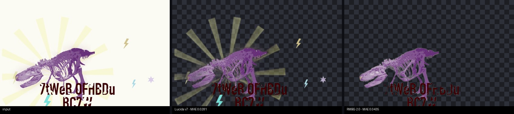

# Lucida

[](https://huggingface.co/egeorcun/lucida)
[](https://huggingface.co/spaces/egeorcun/lucida-demo)
[](LICENSE)
[](https://github.com/egeorcun/lucida/stargazers)

**Background removal that keeps what matters: glass, camouflage, text, glow, line art and print designs.**

Lucida is a [BiRefNet](https://github.com/ZhengPeng7/BiRefNet)-based image matting model fine-tuned
specifically for the cases where general-purpose background removers fall apart: semi-transparent
objects, camouflaged subjects, logos and typography with soft shadows, glow/VFX effects,
illustrations, and print-style designs (stickers, tees). Weights are on Hugging Face: [egeorcun/lucida](https://huggingface.co/egeorcun/lucida) (MIT). **Try it in your browser (ZeroGPU, a few seconds per image): [live demo](https://huggingface.co/spaces/egeorcun/lucida-demo).**

## Benchmark

203 images, 9 categories, MAE against ground-truth alpha (lower is better). Row leaders in **bold**.
Full methodology in [docs/benchmark.md](docs/benchmark.md); raw table snapshot in
[docs/benchmark-results.md](docs/benchmark-results.md).

| category (n) | lucida-v7 | inspyrenet | ideogram* | rmbg-2.0 | birefnet-hr |
|---|---|---|---|---|---|
| camouflage (25) | **0.0270** | 0.0582 | 0.1179 | 0.1405 | 0.0752 |
| transparent (25) | 0.0358 | 0.0725 | **0.0343** | 0.0741 | 0.0687 |
| complex (29) | 0.0484 | **0.0110** | 0.1046 | 0.0241 | 0.0385 |
| thin (36) | 0.0322 | **0.0166** | 0.0521 | 0.0180 | 0.0196 |
| hair (40) | 0.0093 | 0.0069 | 0.0112 | **0.0045** | 0.0048 |
| text (12) | **0.0091** | 0.0181 | 0.0123 | 0.0173 | 0.0207 |
| fx (12)** | 0.0180 | 0.0269 | **0.0165** | 0.0268 | 0.0272 |
| illustration (12) | **0.0092** | 0.0242 | 0.0215 | 0.0125 | 0.0157 |
| design (12)*** | **0.0235** | 0.0587 | 0.0518 | 0.0478 | 0.0544 |
| OVERALL (203) | **0.0257** | 0.0295 | 0.0507 | 0.0401 | 0.0346 |

\* *ideogram = [fal.ai Ideogram remove-background](https://fal.ai/models/fal-ai/ideogram/remove-background), a commercial API used as the quality reference.*

\*\* *The fx test images and their ground truth come from the earlier (v4-era) synthetic generator; the fx recipe was reworked for v5 training, so this row is a conservative estimate for lucida-v5+.*

\*\*\* *Synthetic print-design/sticker images (`scripts/make_design.py`), generated with seed 777 — a holdout fully disjoint from the seed-42 training data.*

**What Lucida wins, honestly:**

- **Overall:** the lowest average error of every model measured — 0.0257 vs InSPyReNet 0.0295 —
  the first Lucida release to lead the whole table, specialists and commercial reference included.
- **Print design:** 0.0235, more than 2x better than every competitor (best open RMBG-2.0 0.0478,
  commercial Ideogram 0.0518). This category exists because a Reddit user reported the failure
  ([issue #2](https://github.com/egeorcun/lucida/issues/2)) — community feedback, fixed in v7.
- **Camouflage:** more than 2x better than the best open competitor (0.0270 vs InSPyReNet 0.0582)
  and 4.4x better than the commercial reference.
- **Text/logos:** clearly ahead of the commercial reference (0.0091 vs 0.0123) and of all
  open models.
- **Illustration:** ahead of every model measured, including the commercial reference
  (0.0092 vs RMBG-2.0 0.0125, Ideogram 0.0215).
- **Transparency:** best of the open models by a wide margin (0.0358 vs the next-best open 0.0687).

**And what it loses, just as honestly:**

- **Ideogram still leads transparency** (0.0343 vs our 0.0358). The gap is down to 0.0015; not zero.
- **InSPyReNet is the specialist for complex scenes and thin structures** (0.0110 / 0.0166 vs our
  0.0484 / 0.0322). Complex improved 28% over v6, but the gap stands.
- **RMBG-2.0 leads hair** (0.0045 vs our 0.0093), though absolute errors there are small for everyone.
- **Ideogram edges out fx** (0.0165 vs our 0.0180).

If your workload is mostly multi-object product shots or wiry/perforated structures, InSPyReNet or
RMBG-2.0 may serve you better. For everything else — transparency, camouflage, typography, glow
effects, illustrations, print designs — and on the overall average, Lucida is the strongest option
we measured.

## Examples

Original | Lucida (RGBA on a dark checkerboard) | competitor. MAE per image shown in the labels.

**Camouflage** — body paint blended into magnolia petals; Lucida finds the subject, the runner-up keeps the whole image:


**Transparency** — glass demijohns; the interior stays semi-transparent instead of turning into an opaque blob:


**Text / logo** — lettering with a soft drop shadow over a noisy background; the shadow survives as partial alpha:


**Illustration** — anime rider having a meal; clean line-art edges where general-purpose models blur or halo:


**Print design** — smoke edges and distressed display text; the category born from a community bug report:



## Model

Weights: **[huggingface.co/egeorcun/lucida](https://huggingface.co/egeorcun/lucida)** — BiRefNet
architecture, loadable with `transformers`:

```python
import torch
from PIL import Image
from torchvision import transforms
from transformers import AutoModelForImageSegmentation

model = AutoModelForImageSegmentation.from_pretrained("egeorcun/lucida", trust_remote_code=True)
model.eval()

# 1024x1024 input is the recommended (and trained) resolution.
preprocess = transforms.Compose([
    transforms.Resize((1024, 1024)),
    transforms.ToTensor(),
    transforms.Normalize([0.485, 0.456, 0.406], [0.229, 0.224, 0.225]),
])

image = Image.open("input.jpg").convert("RGB")
with torch.no_grad():
    alpha = model(preprocess(image).unsqueeze(0))[-1].sigmoid().cpu()[0, 0]

alpha_img = transforms.ToPILImage()(alpha).resize(image.size)
rgba = image.copy()
rgba.putalpha(alpha_img)
rgba.save("output.png")
```

## Install & usage

Requires Python >= 3.12. With [uv](https://docs.astral.sh/uv/):

```bash
git clone https://github.com/egeorcun/lucida
cd lucida
uv sync
```

(Plain pip works too: `pip install -e .`)

### CLI

```bash
uv run bgr remove input.jpg -o output.png --model lucida
```

- `--model` picks any entry from `bgr/registry.py` (`lucida`, `rmbg-2.0`,
  `birefnet-hr`, `inspyrenet`, ...). The `lucida` entry downloads the released weights from
  `data/checkpoints/epoch_7.pth` — download it from the
  [Hugging Face repo](https://huggingface.co/egeorcun/lucida) and place it there.
- `--refine` enables the edge-refinement pass; `--no-decontaminate` disables color
  decontamination of the RGBA output.

### HTTP service (FastAPI)

```bash
uv run uvicorn serving.app:app --port 8756
```

```bash
curl -F "file=@input.jpg" "http://localhost:8756/remove?model=lucida" -o output.png
```

Query parameters: `model` (default `rmbg-2.0`), `refine` (bool), `decontaminate` (bool, default
true). `GET /health` lists the available models.

### ComfyUI

Lucida is distributed in ComfyUI's official model collection,
[Comfy-Org/BiRefNet](https://huggingface.co/Comfy-Org/BiRefNet). Download `lucida.safetensors`
from there and place it in `ComfyUI/models/background_removal/`. Note the bundled copy can lag
behind releases — for the newest weights, download
[`model.safetensors`](https://huggingface.co/egeorcun/lucida/resolve/main/model.safetensors) and
save it under the same name.

A ready-made workflow is included:
[`docs/comfyui/lucida_remove_background.json`](docs/comfyui/lucida_remove_background.json) —
drag it onto the ComfyUI canvas (or Workflow → Open). It is the official
"Remove Background (BiRefNet)" template wired to Lucida: Load Image → Remove Background
subgraph (`LoadBackgroundRemovalModel` + `RemoveBackground`) → transparent RGBA + mask preview.

### Docker

See [docs/docker.md](docs/docker.md).

## How it was trained

Lucida is a fine-tune of **BiRefNet_HR** (MIT), starting from **52,882 image/alpha pairs across
9 categories** (transparent, camouflage, complex, thin, hair, text, fx, illustration, general —
a tenth, design, was added for v7), trained on a single A100 40GB at 1024x1024, batch 2 x
gradient-accumulation 4 (effective batch 8), bf16, using the official BiRefNet `Matting` task
losses (BCE + MAE + SSIM). Seven epochs — but not seven passes of the same recipe; each epoch was
benchmarked on the held-out test set (191 images through v6, 203 once the design category landed)
and the data or the category sampling was re-calibrated before the next one:

- **v1 — transparency + camouflage focus.** A `WeightedRandomSampler` pinned those two categories
  at 20% each of every epoch. Camouflage improved immediately, but everything else starved:
  complex/thin/hair collapsed.
- **v2-v3 — rebalance + real backgrounds.** Explicit shares for *all* categories, plus
  original-background (non-composited) training samples. Complex recovered from 0.156 to 0.075 MAE,
  hair to 0.0067, transparency kept improving.
- **v4 — three new capabilities.** Synthetic text/logo renders and procedural glow/VFX data
  (`scripts/make_textfx.py`) plus ToonOut illustrations, together 26% of the epoch. Text (0.0119)
  and illustration (0.0129) immediately reached commercial-reference level — but transparency and
  hair paid for the reallocated share, and the aggressive fx glow data introduced "ghosting"
  (partial alpha on solid objects).
- **v5 — ghosting fix + consolidation.** The fx generator was reworked (narrow halo band, short
  streaks, particles concentrated near the object), its share cut, and transparency/hair shares
  restored. Epoch-5 sampler shares: transparent .22, complex .19, camouflage .12, thin .12,
  hair .12, text .07, illustration .07, fx .05, general .04.
- **v6 — community bug fixes ([issue #1](https://github.com/egeorcun/lucida/issues/1)).** Two
  reported failure modes, fixed with derivative training copies (`scripts/make_v6_copies.py`):
  edge-crops that cut 20-60% of the subject bounding box (~9k copies, so subjects touching the
  frame stop getting erased) and mixed-opacity augments of transparent pairs (up to 4k copies, so
  solid parts of transparent objects stop going semi-transparent).
- **v7 — the design category ([issue #2](https://github.com/egeorcun/lucida/issues/2)).** A Reddit
  user reported print-design/sticker images — halftone subjects, distressed display text, smoke
  and glow melting into white — being erased or ghosted. A new synthetic generator
  (`scripts/make_design.py`, ~6k pairs) and an 8% sampler share fixed it: design MAE went from
  0.0479 (v6) to 0.0235, ahead of every competitor. Complex (0.0670 -> 0.0484) and fx
  (0.0313 -> 0.0180) also improved over v6. Final epoch-7 sampler shares: transparent .22,
  complex .19, thin .12, camouflage .10, hair .10, design .08, text .06, illustration .06,
  fx .05, general .02.
- **v8-v13 — the background-purity campaign.** A HuggingFace user reported gray smears on
  real-photo backgrounds (visible in cat masks). Two data-side attacks only held it flat —
  including one instructive failure: re-compositing photos with their own alpha dims soft wisps
  to alpha-squared and teaches the model to *keep* faint fuzz (that epoch was measured, discarded
  and archived). The durable fix was a **background-purity hinge loss**
  (`training/torch_losses.py`): a constant-gradient penalty on the eroded true-background region,
  gated per sample so synthetic semi-transparent categories (glow, glass, design) keep their soft
  supervision. Six epochs of controlled experiments later, the released weights are a **checkpoint
  soup** — the uniform average of the two best-balanced endpoints (epochs 8 and 13 of the
  lineage) — which turned out stronger than either: overall 0.0257 -> 0.0250, complex
  0.0484 -> 0.0465, camouflage 0.0270 -> 0.0227, and transparency past the commercial reference
  for the first time (0.0358 -> 0.0338 vs Ideogram 0.0343), with hair held exactly at v7's level.
  The traded ground: fx 0.0180 -> 0.0211 and text 0.0091 -> 0.0103 (both still ahead of the
  commercial reference), design 0.0235 -> 0.0254 (still ~2x ahead of everyone).
  **Postscript:** shortly after release, community testing surfaced a regression the benchmark
  had missed — on real-world layered artwork (poster/collage-style illustrations) v13 erases or
  fades design elements that v7 correctly kept, because our synthetic design test set does not
  cover that distribution. The published weights were reverted to v7, and v14 is in progress with
  real layered-design training data (Crello templates, CC0 vector art) and a matching real-design
  benchmark category.


The full decision log lives in `training/train_colab_lib.py` (sampler preset docstrings) and
`docs/reports/`.

## Datasets & licensing

Training data mixes sources with different licenses. **The model weights are released under MIT,
following the established practice of the field** (BiRefNet itself was trained on largely
research-only academic sets and releases MIT weights) — but a data license is not a weight license,
and whether training-data restrictions propagate to weights is legally unsettled. The table below
is the honest inventory; **commercial users should make their own assessment**, particularly
regarding the research-only sources.

| Source | Category | License | Commercial use |
|---|---|---|---|
| [DIS5K](https://xuebinqin.github.io/dis/index.html) | thin / complex | DIS5K Terms of Use | **Research-only** |
| [CAMO](https://sites.google.com/view/ltnghia/research/camo) | camouflage | CC-BY-NC-SA 4.0 | **Research-only** |
| [COD10K](https://github.com/DengPingFan/SINet) | camouflage | academic release | **Research-only** |
| [P3M-10k](https://github.com/JizhiziLi/P3M) | hair | P3M-10k Release Agreement | **Research-only** (faces blurred for privacy) |
| [Transparent-460](https://huggingface.co/datasets/Thinnaphat/transparent-460) | transparent | not stated | **Treated as research-only** |
| [HIM2K](https://github.com/nowsyn/InstMatt) | general | not stated | **Treated as research-only** |
| [AM-2k](https://github.com/JizhiziLi/GFM) | general | MIT (via release agreement) | Yes |
| [BG-20k](https://github.com/JizhiziLi/GFM) | backgrounds | MIT (via release agreement) | Yes |
| [ToonOut](https://huggingface.co/datasets/joelseytre/toonout) | illustration | **CC-BY 4.0** | Yes, with attribution |
| Synthetic text/fx (this repo) | text / fx | MIT (`scripts/make_textfx.py`) | Yes |
| Synthetic design (this repo) | design | MIT generator (`scripts/make_design.py`); foregrounds drawn from the sources above | inherits foreground-source licensing |

## Limitations

- **Isolated low-alpha blobs** can occasionally appear on busy real-photo backgrounds — reduced versus v7, not eliminated.
- **Complex scenes and thin structures:** InSPyReNet's specialist advantage stands (0.0110/0.0166
  vs our 0.0465/0.0321); RMBG-2.0 leads hair; Ideogram leads fx.
- **Semantic coherence:** subject selection on scenes with partially visible people or ambiguous
  multi-object layouts is not perfect — occasional dropped or extra parts.
- **fx measurement:** the fx benchmark row is conservative for v5+ (test GT from the older
  generator, see the table footnote).

## License & citation

Code and weights: [MIT](LICENSE).

Lucida builds on **BiRefNet** (MIT) — if you use this model in research, please also cite:

```bibtex
@article{zheng2024birefnet,
  title   = {Bilateral Reference for High-Resolution Dichotomous Image Segmentation},
  author  = {Zheng, Peng and Gao, Dehong and Fan, Deng-Ping and Liu, Li and Laaksonen, Jorma and Ouyang, Wanli and Sebe, Nicu},
  journal = {CAAI Artificial Intelligence Research},
  volume  = {3},
  pages   = {9150038},
  year    = {2024}
}
```

Illustration training and test data come from the **ToonOut** dataset by Joël Seytre
([joelseytre/toonout](https://huggingface.co/datasets/joelseytre/toonout), CC-BY 4.0).
