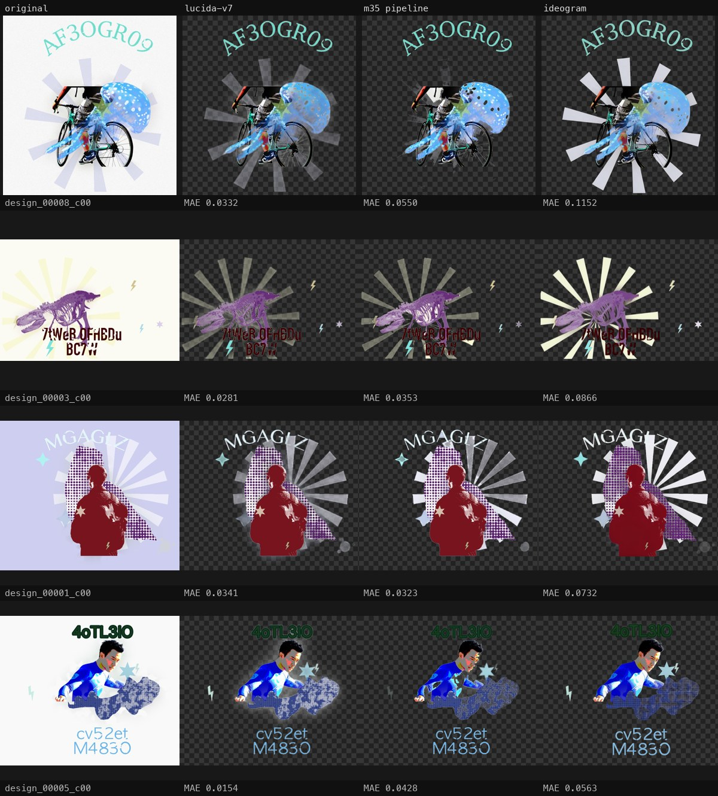
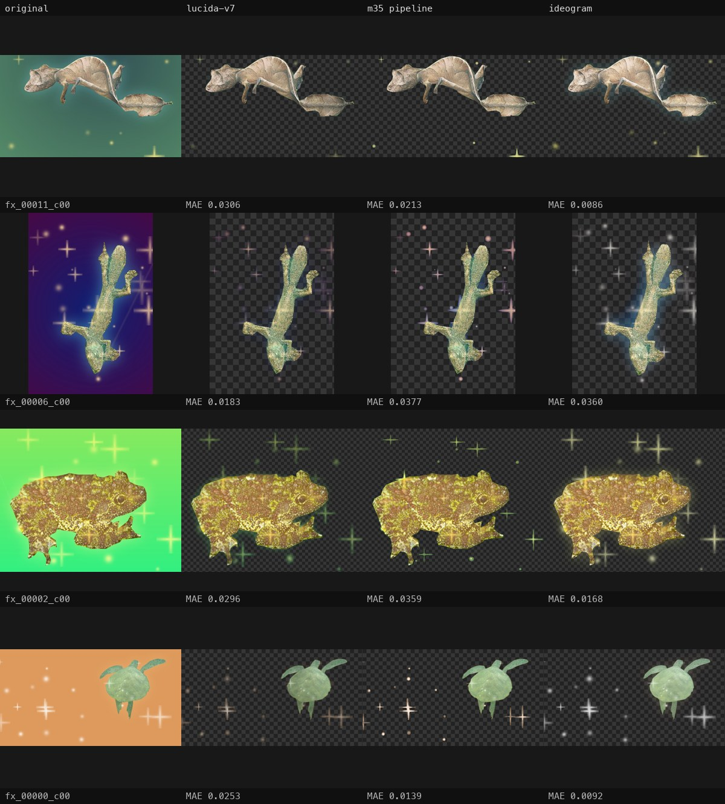
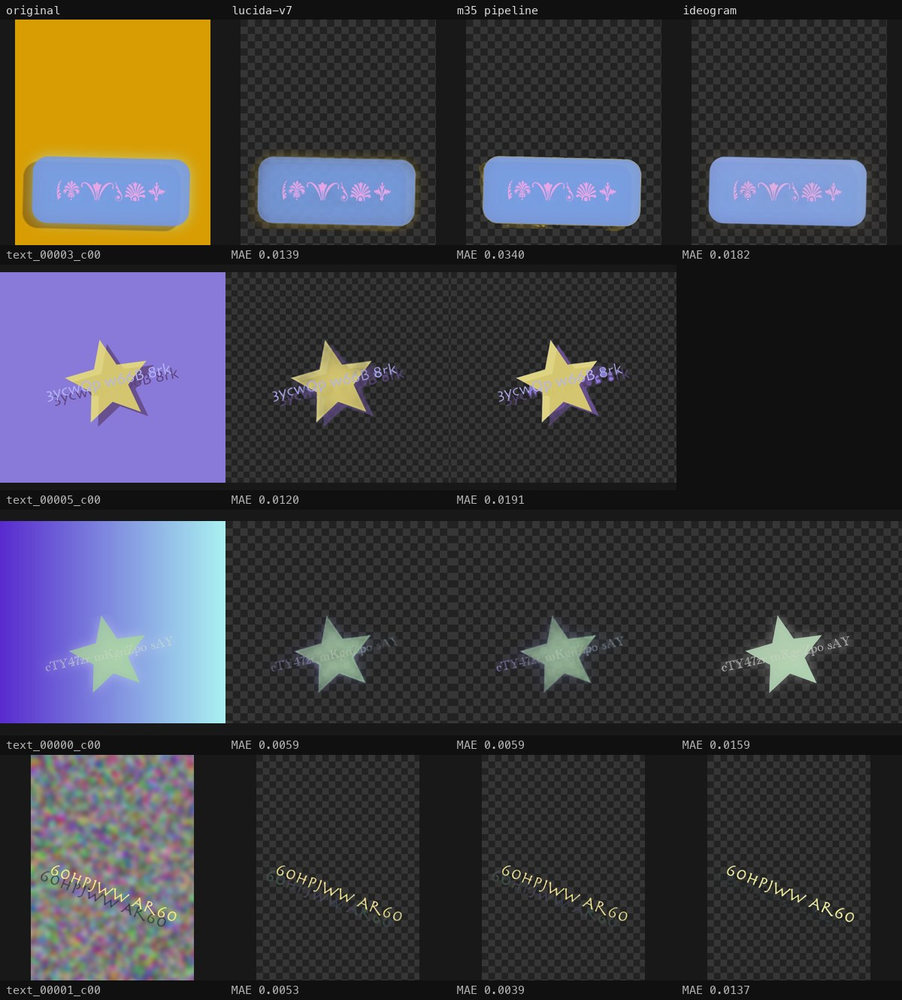
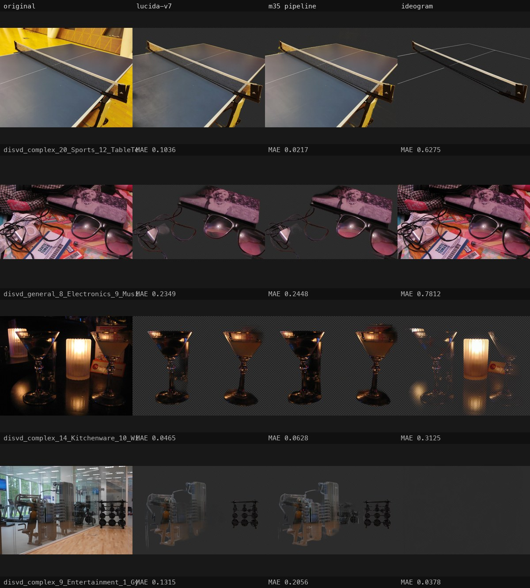

# Design-Expert Three-Way Benchmark (2026-08-05)

Three systems on the design / fx / text / complex categories of the 203-image
testset (65 images with pixel GT, MAE — lower is better):

- **lucida-v7** — the published general-purpose model, bare
- **m35 pipeline** — the design-expert chain: m35 weights + CLIP auto-prompts +
  SAM3 referee + poster policy + domain gates (`scripts/dx_benchmark.py`)
- **ideogram** — fal.ai Ideogram remove-background (cached outputs, same as the
  main benchmark)

| category (n) | lucida-v7 | m35 pipeline | ideogram |
|---|---|---|---|
| design (12) | **0.0238** | 0.0341 | 0.0518 |
| fx (12) | 0.0187 | 0.0216 | **0.0165** |
| text (12) | **0.0093** | 0.0135 | 0.0123 |
| complex (29) | **0.0488** | 0.0489 | 0.1046 |

## How to read this honestly

**The pipeline is not chasing this metric.** The design GT is synthetic (our
own generator, seed-777 holdout) and prefers soft, semi-transparent renderings
— the exact distribution v7 was trained on. The poster policy deliberately
makes *decisive* calls (flat solid fills, open counters, melted atmosphere),
which diverge from that GT even when they look better on a shirt. The duel
catalog on **real** design artwork ([2026-07-30 study](superpowers/specs/2026-07-30-ideogram-study.md))
is the pipeline's actual target: there the bare weights lost to Ideogram 12–1
by eye, and the referee + finish package exists precisely to close that gap —
a difference this synthetic table cannot see. Both Lucida variants beat
Ideogram's MAE on design by a wide margin either way.

**Domain gates earn their keep on complex.** An earlier run of the pipeline
*without* the gates scored **0.3077** on complex — the poster policy's
one-flat-page assumption inverts into damage on photographs (and kept gradient
strips pushed text to 0.126). With the two gates (a MAD flat-page check inside
the policy, a CLIP photo/design classifier in front of it) the pipeline
declines out-of-domain images and hands back the bare m35 alpha: complex lands
at parity with v7 (0.0489 vs 0.0488), and on several photos the m35 weights
beat v7 outright.

**Where Ideogram still leads on numbers:** fx (0.0165) and, by a hair over the
pipeline, text (0.0123 vs 0.0135). Both gaps are small in absolute terms; the
text cost is the policy's decisiveness on synthetic soft-shadow GT.

## Galleries

Columns: original | lucida-v7 | m35 pipeline | ideogram, RGBA composited on a
dark checkerboard, per-cell MAE. Rows are the images with the widest spread
between the three systems (most informative, not cherry-picked winners).

### design


### fx


### text


### complex


## Reproduce

```bash
uv run python scripts/dx_benchmark.py --stage all   # v7 + m35 pipeline + score
uv run python scripts/dx_gallery.py --per-cat 4     # contact sheets
```

Ideogram outputs are the cached `results/ideogram/` set from the main
benchmark fetch.
